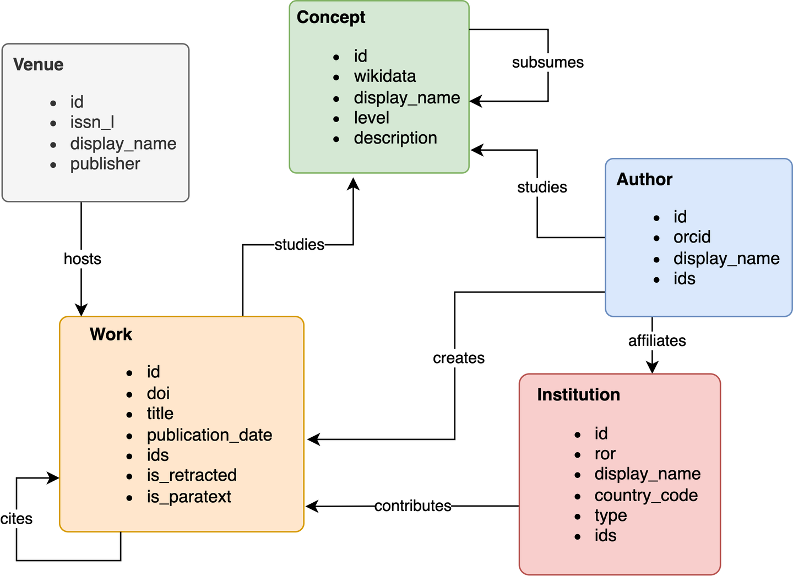

# openalex数据提取
## 1. 从ftp服务器下载数据到本地
> OpenAlex数据校园网内下载地址：
ftp://211.71.15.54:16304/
> 用户名：OpenAlex
> 密码：OpenAlex@G304

在`download.py`中，设置远程路径和本地路径，终端执行`python download.py`，即可下载相应数据到本地，并自动解压为json文件，存储在相应目录下。
* 注：尽量选择较小的子文件夹解压，文件整体太大，本地内存容易崩

## 2. openalex文献开放数据库
openalex是大型免费学术资源索引，其前身是2015年微软发布的微软学术知识图谱（MAG），在2021年数据集停止维护，转为openalex。数据集完全免费开放，其实体结构包括论文、作者、机构、概念、出版物等。

